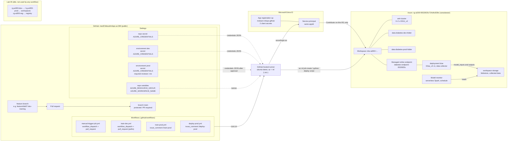
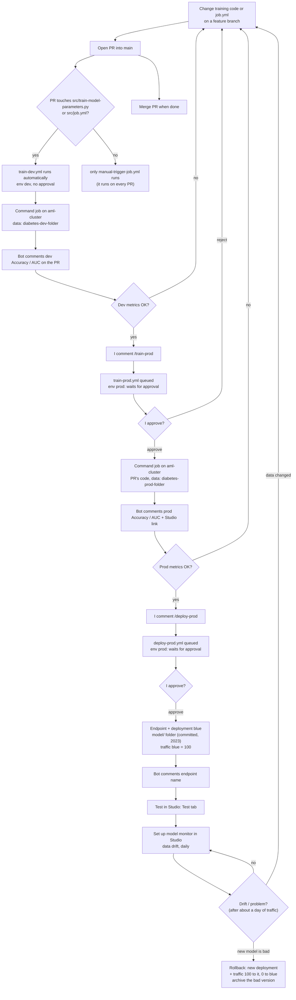
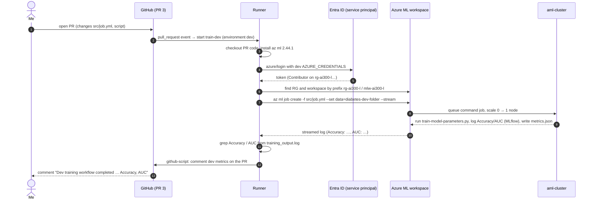
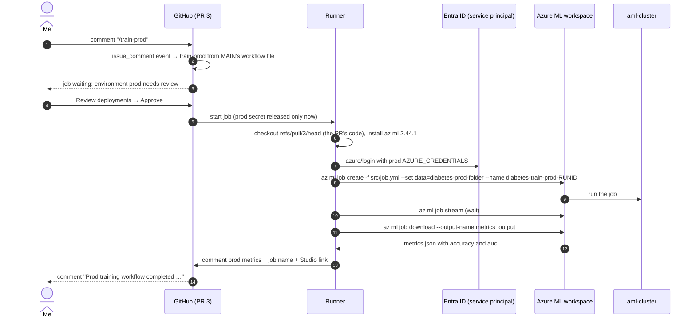
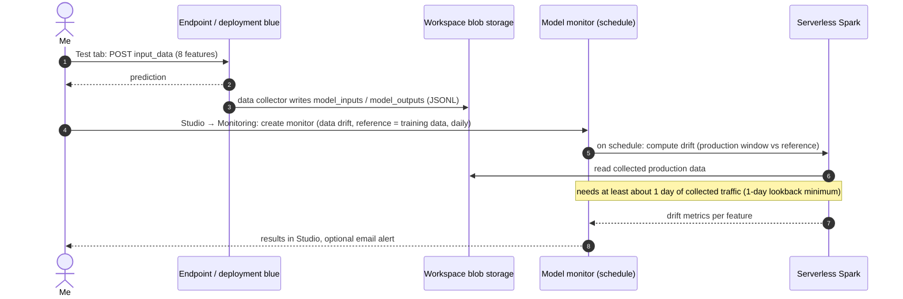

# End-to-end flow (labs 06–07)

How the repo, GitHub Actions, Entra ID and Azure ML fit together, and what
happens, in which order, when you open a PR, comment `/train-prod` and
comment `/deploy-prod`. Everything here matches the real workflow files and
resources of this redo. (GitHub renders these Mermaid diagrams.)

Contents: [1. Architecture](#1-architecture-where-everything-lives) ·
[2. The whole loop (flowchart)](#2-the-whole-loop-flowchart) ·
[3. Sequence: PR → dev training](#3a-sequence-pull-request--dev-training-train-devyml) ·
[/train-prod](#3b-sequence-train-prod-train-prodyml) ·
[/deploy-prod](#3c-sequence-deploy-prod-deploy-prodyml) ·
[monitoring](#3d-sequence-traffic--monitoring-studio-set-up-runs-on-a-schedule)

## 1. Architecture: where everything lives



Key points:
- **One workspace** plays both "dev" and "prod". They're distinguished only by
  the **data asset** (`--set …path=`) and the **GitHub environment** (secret +
  gate). Lab 05's separate workspaces sit idle.
- **One identity** for everything (the same service principal behind all three
  `AZURE_CREDENTIALS`), limited to one resource group.
- The **runner only submits**; training runs on `aml-cluster`, serving on
  the endpoint's own managed compute.

## 2. The whole loop (flowchart)



What the loop really does, in this lab (the honest version):
- **Dev and prod data are byte-identical**, so prod metrics = dev metrics.
- **`/deploy-prod` deploys the committed `model/` folder**, never the model
  `train-dev`/`train-prod` just trained. Retraining changes the PR comments,
  not the endpoint.
- The 🧪 lab shortcuts vs. the 📘 recommended designs are in the lab 07 file.

## 3a. Sequence: pull request → dev training (`train-dev.yml`)



## 3b. Sequence: `/train-prod` (`train-prod.yml`)



## 3c. Sequence: `/deploy-prod` (`deploy-prod.yml`)

```mermaid
sequenceDiagram
  autonumber
  actor Me
  participant GH as GitHub (PR 3)
  participant R as Runner
  participant ID as Entra ID (service principal)
  participant AML as Azure ML workspace
  participant EP as Online endpoint diabetes-endpoint-0533925c
  Me->>GH: comment "/deploy-prod"
  GH-->>Me: job waiting: environment prod needs review
  Me->>GH: Approve
  GH->>R: start job
  R->>R: checkout PR code, Python 3.10, pip install azure-ai-ml azure-identity
  R->>ID: azure/login with prod AZURE_CREDENTIALS
  R->>AML: detect RG/workspace; endpoint name = diabetes-endpoint- + first 8 chars of suffix
  R->>AML: python src/deploy_to_online_endpoint.py (SDK, DefaultAzureCredential)
  AML->>EP: create endpoint if missing (auth: key)
  AML->>EP: create/update deployment blue: Model(path=./model) MLflow, Standard_D2as_v4 x1, DataCollector(model_inputs, model_outputs)
  Note over AML,EP: builds an image for the 2023 model (Python 3.8, MLflow 1.30, sklearn 0.24.1); can take 10+ min
  AML->>EP: traffic blue = 100
  R-->>GH: print scoring URI; comment endpoint + deployment name
  GH-->>Me: comment "Deployment workflow completed"
```

## 3d. Sequence: traffic → monitoring (Studio set-up, runs on a schedule)



## Where the humans are

| Decision | Who | How it's enforced |
|---|---|---|
| Code change reaches `main` | me (merge) | branch protection: PR required |
| Retrain on prod data | me (`/train-prod` + approve) | `environment: prod` required reviewer |
| Deploy to the endpoint | me (`/deploy-prod` + approve) | `environment: prod` required reviewer |
| Who may trigger at all | only prior contributors | interaction limits (public repo) |
| Roll back / retrain after drift | me | a monitoring signal is evidence, not an automatic action |
