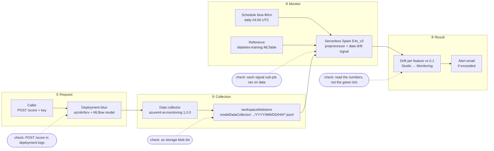
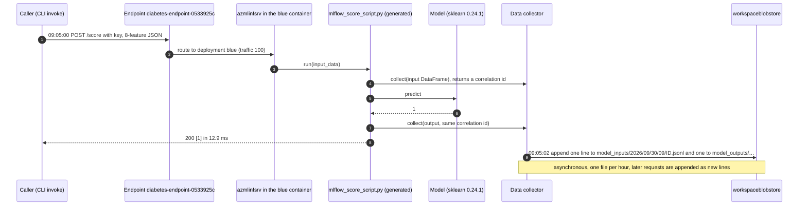
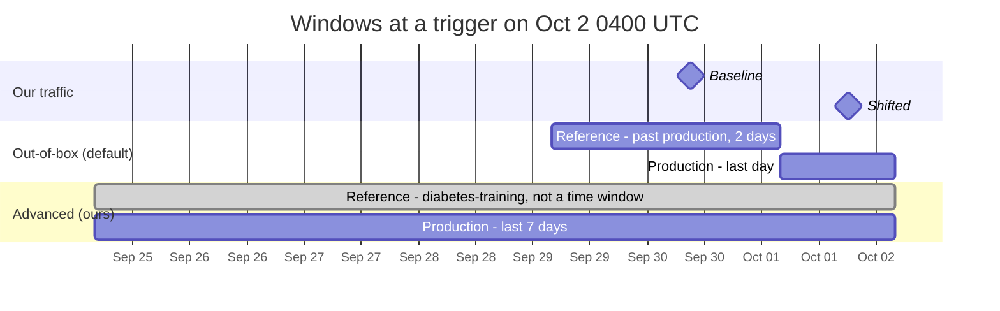
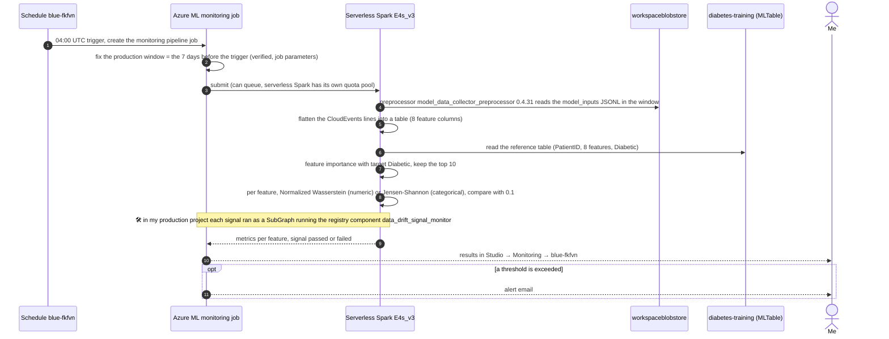
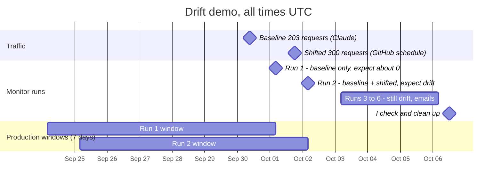
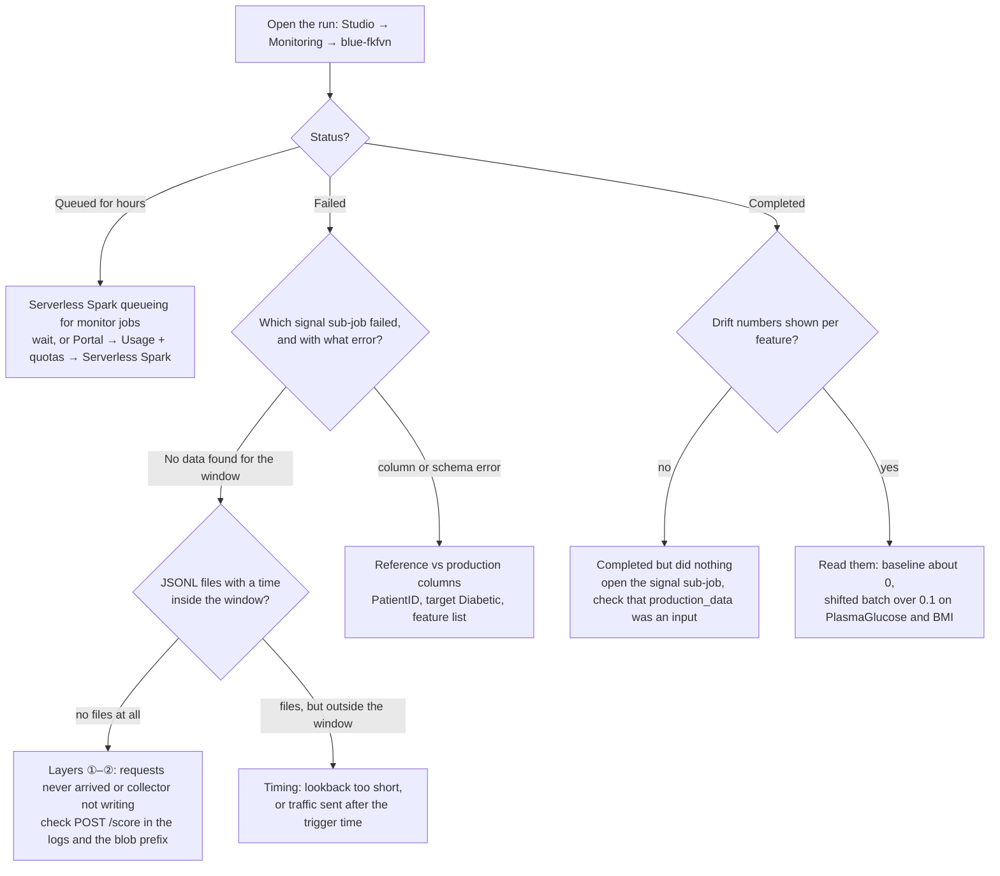

# Model monitoring: 4 layers, checked one at a time

Monitoring is the least reliable part of lab 07. That's not because one thing
is broken: **four separate pieces have to line up**, and a failure in any of
them looks the same from Studio ("no data", or a green run that computed
nothing). This file explains each layer, what we verified on 2026-09-30, and
the traps, so a failed run can be diagnosed layer by layer.

Sources: 📘 Microsoft Learn *Monitor model performance in production*
(updated 2026-03-25) and lab 07's instructions · 🛠 findings from my
production project's `docs/MONITORING.md` (a real multi-day debugging trail) ·
this workspace's real run.

## The one idea

```
① request  →  ② data collector  →  ③ monitor (schedule)  →  ④ result
   /score        JSONL files in        serverless Spark job       drift score per feature,
                 workspace blob        compares production        email alert if a
                                       vs. reference data         threshold is exceeded
```

**A monitor doesn't watch the endpoint. It reads files.** The deployment
writes every request to blob storage. Once a day, a Spark job reads those
files and compares them statistically with a reference dataset. If a layer
is broken, the later layers still "run", just on nothing.



| Layer | Lives where | How to check it directly | Status here |
|---|---|---|---|
| ① Requests reach the model | Deployment `blue` container | `az ml online-deployment get-logs` → `POST /score 200` | ✅ 2026-09-30 09:05 |
| ② Collector writes data | `workspaceblobstore` → `modelDataCollector/…` | `az storage blob list --prefix modelDataCollector/` | ✅ 2026-09-30 09:05 |
| ③ Monitor runs | A **schedule** → a monitoring pipeline job on serverless Spark | Studio → Monitoring, or `az ml schedule list` / `az ml job list` | ▢ set up next |
| ④ Result means something | Monitor overview in Studio: drift per feature | Read the numbers, not just the green check | ▢ first run tomorrow |

## Layer ①: requests reach the model

- **Our Studio Test tab request never arrived.** The logs showed only
  `kube-probe` health checks, with no `POST /score`. The same payload through
  `az ml online-endpoint invoke` worked: `[1]` in 12.9 ms. **Lesson:** "I
  clicked Test" doesn't prove a request happened. The deployment log does.
- The model returns **`1`/`0`**, even though its MLflow signature says
  `boolean` (the 2023 model, MLflow 1.30).

## Layer ②: data collection (verified)

**What turned it on:** `src/deploy_to_online_endpoint.py` passes
`DataCollector(collections={"model_inputs": …, "model_outputs": …})` on the
deployment. The deployment shows:

```json
"data_collector": {"collections": {"model_inputs": {"enabled": "true"}, "model_outputs": {"enabled": "true"}},
                   "rolling_rate": "hour", "sampling_rate": 1.0}
```

**Why it just works here:** the lab deploys an **MLflow model with no
scoring script** (a "no-code" deployment). Azure ML generates the scoring
script (`/var/mlflow_resources/mlflow_score_script.py`) and instruments it
itself. The container log shows it at start-up, with no code of ours:

```
mdc | INFO | mdc collection model_inputs <enabled:True,sample_percentage:100>
mdc | INFO | data collector ready
```

> 🛠 My production project uses a **custom `score.py`**, where that YAML flag
> alone collects **nothing**. The script has to call
> `Collector(name="model_inputs").collect(df)` itself (the
> `azureml-ai-monitoring` package). That was the root cause of days of "No
> data found". Exam angle: *no-code MLflow deployment → auto-collection;
> custom scoring script → the Collector SDK.*

**What it wrote** (about 2 s after the request, one file per collection per hour):

```
modelDataCollector/diabetes-endpoint-0533925c/blue/model_inputs/2026/09/30/09/<id>.jsonl   (848 B)
modelDataCollector/diabetes-endpoint-0533925c/blue/model_outputs/2026/09/30/09/<id>.jsonl  (690 B)
```

One line per request, in CloudEvents format (trimmed):

```json
{"type": "azureml.inference.model_inputs", "time": "2026-09-30T09:05:00Z",
 "data": [{"Pregnancies": 9, "PlasmaGlucose": 104, "DiastolicBloodPressure": 51, "TricepsThickness": 7,
           "SerumInsulin": 24, "BMI": 27.36983156, "DiabetesPedigree": 1.350472047, "Age": 43}],
 "correlationid": "05081145-…", "agent": "azureml-ai-monitoring/1.0.0", "modelversion": "default"}
{"type": "azureml.inference.model_outputs", "data": [{"0": 1}], "correlationid": "05081145-…"}
```

What this tells us:
- **Inputs = the 8 features the caller sent.** There's no `PatientID` and no
  `Diabetic`. The collector records what the model *receives*, not the
  training CSV.
- **The output column is named `"0"`** (an unnamed prediction). This matters
  for prediction drift and model performance signals.
- **`correlationid`** joins an input line to its output line. Studio asks for
  it in the feature attribution drift signal.
- **Hourly folders** (`YYYY/MM/DD/HH`): more requests in the same hour are
  **appended to the same file**, so check line counts, not file counts.
- **Not retroactive:** collection is set on the deployment, and only requests
  made after it's live are recorded.

**One request's path, as measured on 2026-09-30:**



**Azure also registered 2 data assets automatically** when the deployment was
created (by the service principal, 08:08 UTC). These are what the monitor
wizard offers as "production data":

| Data asset | Type | Points to |
|---|---|---|
| `diabetes-endpoint-0533925c-blue-model_inputs:1` | `uri_folder` | `…/modelDataCollector/diabetes-endpoint-0533925c/blue/model_inputs/` |
| `diabetes-endpoint-0533925c-blue-model_outputs:1` | `uri_folder` | `…/blue/model_outputs/` |

## Layer ③: the monitor

A monitor is a **schedule** (the same object as lab 04's pipeline schedules)
whose action is `create_monitor`. Each run is a pipeline job that runs **one
sub-job per signal** on **serverless Spark**.

### Out-of-box vs. advanced: what the reference data is

| | Out-of-box (📘 the default) | Advanced (what lab 07 asks for) |
|---|---|---|
| Production data | Auto-detected from the deployment | The `…-model_inputs` asset, with a lookback window you choose |
| **Reference data** | **The endpoint's own recent past production data** | **The training data asset** |
| Signals | Data drift, prediction drift, data quality (auto-added) | Whichever you configure; the lab enables **data drift** |
| Metrics and thresholds | "Smart defaults" (🛠 observed: Normalized Wasserstein for numeric features, Jensen-Shannon for categorical ones, threshold 0.1) | You choose them in the signal editor |
| Question it answers | "Did traffic change **recently**?" | "Is traffic different from **what the model learned**?" |
| Feature importance | No | Yes, if reference = training data **and** a target column is set |

**The two window layouts** at a trigger on Oct 2, 04:00 UTC:



- **Out-of-box** compares two **non-overlapping** slices of production
  traffic. On Oct 2 it would compare the shifted batch with the baseline,
  which would also show drift. On **Oct 1**, its reference slice (Sep 28–30
  04:00) would be **empty**, so it would fail. That's why the pre-added
  signals were deleted.
- **Advanced** compares the production window with the **training data**,
  which is always there. Only the production side needs traffic.

⚠ Even in the advanced wizard, Studio **pre-adds 4 signals** (seen
2026-09-30): data drift, data quality and prediction drift (using past
production as their reference), plus **feature attribution drift
(preview)**. The last one shows in red and **keeps Next disabled** until
it's configured or deleted. Only the data drift signal gets edited to use
training data. The others need a production history from **before** the
last day, which we don't have. We kept only **data drift** (what the lab
asks for).

**The wizard's first page, "Configure data asset"**, pre-lists the two
collector assets, each with the preprocessing component **"Model Data
Collector - Preprocessor"**
(`azureml://registries/azureml/components/model_data_collector_preprocessor/versions/0.4.31`).
That's the step that turns the CloudEvents JSONL into a table the drift
computation can read. The training data (`mltable`) needs no preprocessor.

### Which reference data asset

The lab offers "`diabetes-training` or `diabetes-dev-folder`":

| Asset | Type | Columns | Use it? |
|---|---|---|---|
| `diabetes-training:1` | **`mltable`** (lab 01) | PatientID, 8 features, **Diabetic** | ✅ Microsoft's YAML and SDK examples use `type: mltable` for reference data |
| `diabetes-dev-folder:1` | `uri_folder` (a CSV) | the same | ▢ it may not be offered, or may not be readable as a table |

- **Target column = `Diabetic`**: the label column in the training data. It
  turns on feature importance and **Top N features**.
- **`PatientID`** is in the reference data but not in production data. We
  chose **Top N = 10** (what the docs show): the training data has only 9
  candidate columns (the 8 features + `PatientID`), so all of them are
  "top", `PatientID` included. ▢ Verify on the first run how it's handled
  (skipped, reported, or a failure). Fix if needed: edit the signal to
  select specific features.

### Compute: serverless Spark, a separate quota pool

- 📘 Only `Standard_E4s_v3`, `E8s`, `E16s`, `E32s` or `E64s_v3` are allowed
  ("Virtual machine size" in the wizard). Pick the smallest, **E4s_v3**.
- 🛠 A monitor **can't** run on `aml-cluster`. Its compute type only allows
  serverless Spark (or an attached Synapse pool), and resubmitting on
  AmlCompute fails: `Spark component supports only synapse compute type…`.
- Its quota is a **separate pool**. The "ESv3 = 20" from
  `az ml compute list-usage` (lab 01) is the *dedicated* cluster quota for
  that VM family. 🛠 Serverless Spark has its own pool, visible only in
  Portal → Usage + quotas (Serverless Spark). 🛠 My production project saw monitor jobs
  sit **Queued for 14+ h**, while an interactive Spark session started
  instantly. Queueing specific to monitor jobs is possible and outside our
  control.
- Billed only while a run executes (🛠 the signal computation itself took
  about 2 min once it started).

### One monitor run, step by step



### What Studio actually created (the record)

The wizard produced **schedule `blue-fkfvn`** (created 2026-09-30 09:19 UTC,
enabled). Nothing about it is in Git, so this section is the record. It was
read back with `az rest GET …/schedules/blue-fkfvn?api-version=2024-10-01`.
⚠ `az ml schedule list/show` (local ml extension 2.38.1) **can't
deserialize it**: `Value 'ModelInputs' passed is not in set ['model_inputs', …]`.
Studio writes a different casing than the CLI expects. This is a tooling
mismatch, not a monitor problem.

What the raw definition says:

| Field | Value | Meaning |
|---|---|---|
| `trigger` | `frequency: Day`, `hours: [4]`, `minutes: [0]`, **`timeZone: UTC`** | **04:00 UTC** = midnight in my time zone (UTC−4). Not 4 AM local: Studio's "4 AM" is UTC |
| `computeConfiguration` | `ServerlessSpark`, `standard_e4s_v3`, runtime `3.4`, identity `AmlToken` | Serverless Spark, the smallest allowed size |
| `monitoringTarget` | deployment `blue`, model `c68e03c6…fc8f96:1`, `taskType: Classification` | The model is the implicit hash-named registration the deploy script created |
| `productionData` | `…-blue-model_inputs:1`, `uri_folder`, `dataContext: ModelInputs`, preprocessor `model_data_collector_preprocessor:0.4.31`, **`inputDataType: Rolling`**, `windowSize: P7D`, `windowOffset: PT0S` | A sliding 7-day window over the collected JSONL |
| `referenceData` | `diabetes-training:1`, `mltable`, `target_column: Diabetic`, **`inputDataType: Fixed`** | A static reference: always "there", so no reference-window timing problem |
| `features` | `filterType: TopNByAttribution`, `top: 10` | Top N by feature importance |
| `metricThresholds` | Numerical `NormalizedWassersteinDistance` 0.1, Categorical `JensenShannonDistance` 0.1 | The same values my production project saw as "smart defaults" |
| `alertNotificationSettings` | my email | Microsoft's default: whoever set it up |

The same monitor as CLI YAML, in the format of Microsoft's advanced example
(reconstructed for the record, **not applied**; this is what my production
project keeps in Git instead of clicking):

```yaml
$schema: http://azureml/sdk-2-0/Schedule.json
name: blue-fkfvn
trigger:
  type: recurrence
  frequency: day
  interval: 1
  schedule:
    hours: 4          # UTC
    minutes: 0
create_monitor:
  compute:
    instance_type: standard_e4s_v3
    runtime_version: "3.4"
  monitoring_target:
    ml_task: classification
    endpoint_deployment_id: azureml:diabetes-endpoint-0533925c:blue
  monitoring_signals:
    data-drift-signal:
      type: data_drift
      production_data:
        input_data:
          path: azureml:diabetes-endpoint-0533925c-blue-model_inputs:1
          type: uri_folder
        data_context: model_inputs
        pre_processing_component: azureml://registries/azureml/components/model_data_collector_preprocessor/versions/0.4.31
        data_window:
          lookback_window_size: P7D
          lookback_window_offset: P0D
      reference_data:
        input_data:
          path: azureml:diabetes-training:1
          type: mltable
        data_context: training
        data_column_names:
          target_column: Diabetic
      features:
        top_n_feature_importance: 10
      metric_thresholds:
        numerical:
          normalized_wasserstein_distance: 0.1
        categorical:
          jensen_shannon_distance: 0.1
  alert_notification:
    emails:
      - <my email>
```

## Timing: why the first run can't be today

| Rule | Source | Effect here |
|---|---|---|
| **Lookback window ≥ 1 day.** `PT1H` fails with `LookbackInvalidArgument` | 🛠 observed in my production project (not in the docs) | No "quick test" monitor; the earliest meaningful run is the next scheduled one |
| **Schedule frequency ≠ window.** Running every minute doesn't shrink the 1-day window | 🛠 | "Daily" is the right schedule |
| **Out-of-box:** reference = the 2 days **before** the last day, production = the last day (non-overlapping) | 🛠 reverse-engineered from a real "No data found" error | One batch of traffic can never fill both windows. This is why the pre-added signals fail |
| **Advanced:** the reference is the training asset (always there), and only the production window needs traffic | Follows from the above. ▢ verify on the first run | Today's traffic counts as long as it's inside the production lookback. **Choose a lookback of several days (for example 7)**, so traffic from 09:05 today isn't just outside a 1-day window when the run fires |
| Manual trigger: `az ml schedule trigger -n <monitor>` | 🛠 | Same windows, just now instead of at the scheduled time. Useful tomorrow |
| ⚠ **Studio's "Next run" said Oct 2, 12:00 AM** (local = **Oct 2 04:00 UTC**), while the stored trigger (daily 04:00 UTC from Sep 30) gives **Oct 1 04:00 UTC** | Seen 2026-10-01 00:30 UTC | Unexplained: a Studio display quirk, or the first run held back a day. We triggered run 1 by hand so the baseline exists either way. ▢ See which date the scheduled run really fires |

### The drift demo on a timeline (UTC)



- Run 1's window ends at **Oct 1 04:00**, before the shifted batch (18:17),
  so it only sees the baseline.
- Run 2's window contains **both** batches (300 shifted vs 203 baseline).
  The mix is still far enough from the training data to cross 0.1 on
  PlasmaGlucose and BMI (expected, ▢ verify).
- Without cleanup, the baseline leaves the window with the Oct 8 run. From
  **Oct 9**, runs find no data and fail. The cleanup on Oct 6 removes the
  monitor first.

## Traps: why "Completed" or "Failed" can mislead

| Trap | What you'd see | How to tell |
|---|---|---|
| No request actually arrived (our Studio Test) | Monitor: "No data found" | Deployment log has no `POST /score`, and the blob prefix is empty |
| Custom scoring script without `Collector` calls | Same | Same (not our case: no-code MLflow) |
| Traffic outside the lookback window | Same | Compare the JSONL `time` values with the run's window in its error |
| Pre-added out-of-box signals with no past production | Those signals fail; the run may show as failed overall | Open the run: which **signal** sub-job failed |
| 🛠 **"Completed but did nothing"**: signal sub-jobs tolerate missing optional inputs (✅ our run's properties: `azureml.continue_on_failed_optional_input: True`, `azureml.continue_on_step_failure: True`) | Green check, no metrics | Open the signal sub-job and check that `production_data` was actually an input and there's an output |
| Monitor jobs stuck Queued | Hours of "Queued", 0 compute used | Not quota you can see with `az ml compute list-usage`. Wait, or check Portal → Usage + quotas → Serverless Spark |
| Reference and production columns differ | Failure or odd features in the results | Target column = `Diabetic`, and select the 8 features explicitly |

### Diagnosing a run, layer by layer



## What "drift" means in this lab (be honest about it)

- Data drift compares **input distributions**. It needs **many** requests: a
  handful of Test tab calls give an unstable distribution.
- Dev and prod data are identical to the training data, so realistic traffic
  sampled from them should show **near-zero drift**. That's a correct result
  (a baseline), not a failure.
- The lab's "simulate drift" step changes `--reg_rate`, a **training**
  parameter. That changes the model, not the incoming data, so the monitor
  can't see it. It's a stand-in for "respond to drift by retraining".
- To see real drift, send a **shifted** batch (for example, higher
  `PlasmaGlucose` and `BMI`) through the endpoint. The drift score for those
  features should cross the threshold on the next run.

## Unattended traffic (our helper, not the lab)

The shifted batch has to arrive **after** run 1 and **before** run 2, so it
must not depend on anyone being online. `.github/workflows/send-monitor-traffic.yml`:

- **`schedule: cron '17 18 1 10 *'`**: Oct 1, 18:17 UTC. Not on the hour,
  because GitHub delays `:00` schedules the most. A scheduled workflow always
  runs from **`main`**, so it had to be merged first (PR #6).
- **`workflow_dispatch`** with `mode`/`n` inputs: tested with `baseline × 3`
  → `200: 3` (run `36697165251`).
- **Repo secret, not the `prod` environment**: an unattended job can't wait for
  a required reviewer. That's acceptable because it only sends test traffic.
- **A year guard** (it does nothing outside 2026), and the file is deleted at cleanup.
- **The window is fixed when the monitor job is *created*** (the trigger
  time), so a monitor run that sits queued at 04:00 still only reads data
  sent before 04:00. ✅ Verified on the manual run (2026-10-01 00:34 UTC). Its
  job parameters say `data_window_start 2026-09-24T00:34:37Z`,
  `data_window_end 2026-10-01T00:34:37Z` = `monitor_current_time`.

⚠ Side effect we learned: opening PR #6 **started a training job**. The
lab 06 `manual-trigger-job.yml` runs on **every** PR into `main`, whatever
the PR changes (no `paths` filter). Its GitHub run was cancelled, but the Azure
ML job had already finished. Cancelling a workflow **doesn't cancel the job it
already submitted**: `az ml job cancel` is a separate call.

## Verification checklist (tick as we go)

- [x] ① `POST /score 200` in the deployment log (09:05 UTC)
- [x] ② JSONL in `modelDataCollector/…/model_inputs/2026/09/30/09/` with the 8 features, `agent: azureml-ai-monitoring/1.0.0`
- [x] ② Data assets `…-blue-model_inputs` / `…-model_outputs` auto-registered
- [x] ② 200 baseline requests (held-out test rows) appended to the same hourly file (201 lines)
- [x] ③ Monitor `blue-fkfvn` created: data drift only, reference `diabetes-training:1` + target `Diabetic`, Top N 10, lookback P7D, daily 04:00 UTC, E4s_v3
- [ ] ③ ▢ How `PatientID` is handled (Top 10 over 9 candidate columns)
- [ ] ④ First run: status of each signal sub-job, **not just the parent**, and actual drift numbers
- [ ] ④ ▢ Baseline traffic → low drift. Shifted traffic → a threshold exceeded → an email alert

## Lab vs. my production project

| | Lab 07 | My project |
|---|---|---|
| Collection | 🧪 Auto (no-code MLflow deployment) | 🛠 `Collector` SDK in `score.py` (it needs a derived feature, so it can't be no-code) |
| Monitor definition | 🧪 Studio wizard clicks, nothing in Git | 🛠 `endpoints/monitor.dev.yml` → `az ml schedule create -f` (versioned, reviewable, re-creatable) |
| Reference data | 📘 **Training data** (advanced): catches drift away from what the model learned | 🛠 Out-of-box (past production): only "recent change", blind to slow drift. A known gap |
| Signals | Data drift | Data drift, prediction drift, data quality |
| Traffic | 🧪 Manual test requests | 🛠 A `monitor-traffic.yml` workflow sends traffic twice a day |
| Acting on a signal | Human: new PR → retrain → `/deploy-prod`, or roll back traffic | Human: the same idea, via the registry promotion flow |

**Exam (📘):** data collection is enabled **on the deployment**; model
monitoring runs on **serverless Spark**; out-of-box uses **past production**
as the reference, and advanced uses **training data** (for drift and
quality) or **validation data** (for prediction drift); feature importance
needs the training data + a **target column**; by default, an exceeded
threshold emails the person who set up the monitor; a drift signal is
**evidence for a human decision** (investigate, retrain, roll back), not an
automatic action.
