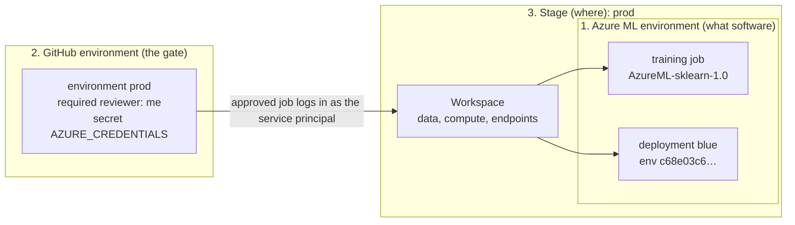

# "Environment": three different things

The AI-300 material uses one word for three unrelated ideas, sometimes in
the same sentence. For example: *"the job waited for approval in the prod
environment, then deployed to the production environment, but the
environment's image failed to build"*. That sentence uses all three meanings,
and each one needs a different fix.

| | **1. Azure ML environment** | **2. GitHub environment** | **3. Dev/prod environment** |
|---|---|---|---|
| **One-line idea** | *What software* a job or deployment runs inside | *Who may act, and with which credentials*: a gate in the repo | *Which stage* of the lifecycle: experiment, validate, serve |
| Lives in | Azure ML (workspace or registry) | GitHub repo → Settings → Environments | The architecture: resource groups, workspaces, subscriptions |
| Made of | A Docker base image + Python packages (conda/pip) | Secrets, variables, protection rules | Separate identities, data, compute, network, billing |
| Defined by | `environment:` in a job/deployment, an environment YAML, or derived from an MLflow model | `environment: prod` on a workflow job | Bicep/CLI provisioning, naming, RBAC |
| Our real example | `AzureML-sklearn-1.0-ubuntu20.04-py38-cpu`; `c68e03c6…fc8f96` (auto-created for the deployment) | `dev`, `prod` (required reviewer) | Lab 05's `mlw-ai300-dev-…` / `mlw-ai300-prod-…` (deleted); lab 07's simulated dev/prod |
| Answers the question | "Why do I get a different result or an import error?" | "Why is the job waiting?" / "Who approved this deploy?" | "Can dev touch prod data?" / "What gets promoted?" |
| Exam module | Train (jobs), Deploy (endpoints) | Automate with GitHub Actions | Plan and prepare (environments, registries) |

**How they fit together:** the **GitHub environment** decides *who may act
on* a stage. The **stage** (dev/prod) is *where* things run. The **Azure ML
environment** is *what software* they run in.



---

## 1. Azure ML environment: the runtime

### The one idea

A job's result depends on **code + data + environment**. The environment
pins the software: an OS image, the Python version, and every package
version. Azure ML turns that definition into a **Docker image**, and every
job or deployment runs in a container started from it. The same code and
data in a different environment can give a different number, which we saw
in lab 02 (below).

### What an environment is made of

| Part | What it is | Example |
|---|---|---|
| **Base image** | A Docker image (OS, system libraries, often a Python) | `mcr.microsoft.com/azureml/curated/mlflow-py312-inference@sha256:ccf9…` |
| **Conda/pip file** | The Python version and packages to install on top | `python=3.8`, `scikit-learn==0.24.1`, `mlflow==1.30.0`, … |
| *or* **Build context** | A folder with a `Dockerfile`, when you need more control | not used in these labs |
| **Inference config** (deployments only) | Liveness/readiness/scoring routes for a custom serving image | not needed: the inference server provides them |
| **Name + version** | `name:version` or `name@latest`; **versions are immutable** | `AzureML-sklearn-1.0-ubuntu20.04-py38-cpu@latest` |

**Immutable versions:** you can't edit an environment version. Changing
one package means creating a new version. 🛠 My production project had to do
exactly that to add `azureml-ai-monitoring` to its scoring environment.

### The three kinds

| Kind | Who makes it | Example here | Notes |
|---|---|---|---|
| **Curated** | Microsoft, prebuilt and maintained, named `AzureML-…` | `AzureML-sklearn-1.0-ubuntu20.04-py38-cpu` (labs 02–07 jobs) | The image already exists, so jobs start faster. Read-only. Our workspace lists **26** environments, most of them curated |
| **Custom** | You: image + conda file, or a Dockerfile, registered with `az ml environment create` | none in these labs (a gap: "create and manage environments" is 👀 in the coverage table) | 📘 The exam answer for "pin exact package versions" or "packages the curated ones don't have" |
| **Created for you** | Azure ML, when you deploy an MLflow model without giving an environment | `c68e03c630c5…fc8f96` (below) | Named after the model's content hash; `environmentType: UserCreated`, even though no user wrote it |

The list also shows **no-code deployment base environments**:
`DefaultNcdEnv-mlflow-ubuntu20-04-py38-cpu-inference` and
`MlflowNCDEnv-mlflow-py312-inference`. "NCD" = no-code deployment. These are
the bases Azure uses for MLflow models. Ours was built on the `py312` one.

### Traced for real: the environment behind deployment `blue`

Our `deploy_to_online_endpoint.py` passes **no environment at all**, only
`Model(path="./model", type=MLFLOW_MODEL)`. Here's what Azure did, read back
on 2026-09-30:

```
model/conda.yaml (logged by MLflow in 2023, at training time)
  │  python=3.8, mlflow==1.30.0, scikit-learn==0.24.1, azureml-ai-monitoring==1.0.0, …
  ▼
08:08:46 UTC  Azure creates environment  c68e03c630c5…fc8f96 : fb674d0ce36f…  (by the service principal)
              base image  mcr.microsoft.com/azureml/curated/mlflow-py312-inference@sha256:ccf9…
              conda       the model's conda.yaml + azureml-inference-server-http   ← Azure added the server
  ▼
08:08:49 UTC  Azure creates the workspace's container registry (ACR, Basic)   ← it didn't exist before
  ▼
08:16:05 UTC  image azureml/azureml_708a01e5… pushed (tags 1, latest)         ← ~7 min: the slow part of the first deploy
  ▼
08:51–08:59   /deploy-prod (the lab's way) redeploys blue → the same environment version, no new image
```

What this shows:
- **Where the package list came from:** MLflow's `log_model` records the
  training machine's package versions in `conda.yaml`. That's how a 2026
  deployment knows the model needs **scikit-learn 0.24.1** from 2023.
- **Two Pythons in one image:** the base image is `py312`, but conda
  installs `python=3.8` in its own environment. The deployment log shows the
  model running from `/azureml-envs/azureml_6a15d606…/lib/python3.8/`. That's
  how an old model runs on a current base image.
- **Serving needs a server:** Azure added `azureml-inference-server-http`
  (the `azmlinfsrv` process in the logs) plus a generated scoring script
  (`/var/mlflow_resources/mlflow_score_script.py`). A training environment
  doesn't need either.
- **The container registry is created on demand.** Labs 01–06 only used
  curated images from Microsoft's registry (`mcr.microsoft.com`), so the
  workspace had none. The first custom image build created it. It's a
  Basic-tier ACR, billed daily, and it goes when the resource group is
  deleted.
- **Same definition → same version → no rebuild.** The version name is a
  content hash (`fb674d0c…`). Redeploying the same model reused the image,
  which is part of why the second deploy was faster.

### Where each lab used which environment

| Lab | What ran | Environment |
|---|---|---|
| 01 | AutoML trials | Chosen by AutoML (not set in the lab) |
| 01–02 | Notebooks, terminal on the compute instance | **Not an Azure ML environment**: the compute instance's own conda env `azureml_py38`, which turned out to run Python 3.10 (kb/02) |
| 02–04 | Command, sweep and pipeline jobs | Curated `AzureML-sklearn-1.0-ubuntu20.04-py38-cpu@latest` (scikit-learn 1.0.2, Python 3.8.16, from lab 04's `MLmodel`) |
| 06–07 | `src/job.yml` from GitHub Actions | The same curated environment |
| 07 | Deployment `blue` | Auto-created `c68e03c6…fc8f96` from the model's `conda.yaml` |

**The number that proved it matters (lab 02):** the same script and data gave
AUC **0.84849** in the compute instance terminal and **0.84828** as a job.
The difference was the scikit-learn version (autolog showed
`multi_class: deprecated` vs. `auto`).

⚠ The curated environment's definition **can't be read** in this workspace:
`az ml environment show/list -n AzureML-sklearn-1.0-…` returns
`UserError: System.Net.Http.HttpConnectionResponseContent` (the REST API
also fails). Jobs resolve it and run fine. It's a read-path quirk, and
Studio → Environments → Curated shows it.

### Exam cues (📘)

| If the question says… | It's about… | Answer direction |
|---|---|---|
| "Ensure every run uses the same package versions" | Azure ML environment | Register a **custom environment** with pinned versions, and reference `name:version` |
| "A needed package isn't in any curated environment" | Azure ML environment | Custom environment: a curated/base image + conda file, or a Dockerfile |
| "Deploy an MLflow model without writing a scoring script or environment" | Azure ML environment (derived) | **No-code MLflow deployment**: the environment comes from the model's logged dependencies |
| "The deployment fails while building" | Azure ML environment (image build) | Deployment logs / image build logs: a package conflict in the conda file |
| "Reuse the same environment in dev and prod workspaces" | Azure ML environment + stage | Register it in a **registry** |

---

## 2. GitHub environment: the gate

Full mechanics:
[github-actions-azureml.md → GitHub environments](github-actions-azureml.md#github-environments-lab-07s-dev-and-prod).
The essentials:

### The one idea

A named deployment target in the repo's settings. It holds its **own
secrets and variables** and **protection rules**. A workflow job opts in
with `environment: <name>`. Until the rules pass, the job doesn't start and
gets no secrets. Every approved run is recorded as a **deployment** to that
environment.

### This repo (read back 2026-09-30)

| | `dev` | `prod` |
|---|---|---|
| Secret | `AZURE_CREDENTIALS` | `AZURE_CREDENTIALS` |
| Rule | none: runs immediately | **required reviewer (me)**: waits for approval |
| Used by | `train-dev.yml` (on PRs) | `train-prod.yml`, `deploy-prod.yml` (on `/train-prod`, `/deploy-prod` comments) |

- **Name precedence:** environment secret > repository secret >
  organization secret. The job's `environment:` line decides which
  `AZURE_CREDENTIALS` it gets.
- **Rules available:** required reviewers (up to 6; one approval is
  enough), prevent self-review, a wait timer, **deployment branches**
  (only `main` may deploy to prod), and custom rules from GitHub Apps. We
  use only the reviewer.
- **Plan limit:** on GitHub Free, protection rules only work in **public**
  repos. That's why this repo is public.

### Why it matters for Azure

In this lab all three `AZURE_CREDENTIALS` are **the same service principal**
on the same resource group: 🧪 the gate controls *who and when*, not *what
it can touch*. 📘 In a real setup, each GitHub environment holds the identity
for **its own stage**, and with **OIDC** the federated credential's subject
`repo:<owner>/<repo>:environment:prod` makes Entra ID issue prod tokens
**only** to jobs running in the `prod` environment. That links the GitHub
environment (2) to the stage (3).

### Exam cues (📘)

| If the question says… | Answer |
|---|---|
| "Require approval before deploying to production" | A GitHub environment with **required reviewers** |
| "Only the main branch may deploy to production" | Deployment branch policy on the environment (and/or branch protection) |
| "Different credentials for dev and prod workflows" | Environment secrets with the same name, one per environment |
| "No long-lived secret in GitHub" | OIDC federated credential, scoped to the environment |

---

## 3. Dev/prod environment: the stage

### The one idea

A **stage** of the model lifecycle: **dev** (experiment, train), often
**test/staging** (validate as if in prod), and **prod** (serve real users).
What makes stages *separate* is what they don't share: identity and access,
data, compute, network, subscription/billing, and sometimes region.

📘 Microsoft's guidance: **one workspace per stage** (often in separate
subscriptions) and a **registry** to move assets between them. **Assets**
(models, environments, components, data) can be shared or promoted.
**Resources** (compute, jobs, endpoints) stay in their own workspace. What
gets promoted, the model (A) or the pipeline (B), is the
[promotion pattern](registries-and-environments.md#two-promotion-patterns-and-what-the-registry-carries-in-each).

### The three versions we've seen

| Dimension | Lab 07 (simulated) 🧪 | Lab 05 design | My production project 🛠 |
|---|---|---|---|
| Stages | dev, prod | dev, prod | dev, staging, prod |
| Workspaces | **One** (`mlw-ai300-l…`) | Two (`mlw-ai300-dev-…`, `mlw-ai300-prod-…`); **deleted 2026-09-30** | One per stage (Bicep, one `.bicepparam` each) |
| What differs between "dev" and "prod" | The **data asset** (`--set inputs.training_data.path=…`) and the **GitHub environment** | Separate RGs, workspaces and data; prod had no compute | Separate RGs, identities, endpoints |
| Data | `diabetes-dev-folder` vs `diabetes-prod-folder`: **byte-identical** | Dev data in dev, prod data in prod | Per stage |
| Identity | The same service principal for both | (not wired to GitHub) | A separate identity per stage, OIDC |
| Shared assets | Nothing to share (one workspace) | A registry, **created but never used** | Registry `mlreg-diabetes`: the model promoted dev → staging → prod |
| Promotion | Git: the same `job.yml` reruns on prod data; the deploy uses the committed `model/` | Designed for A or B | **A**: the same model version everywhere |

So in lab 07, "prod" is a **label** made of two things: a data asset and a
GitHub environment. The separation is logical, not physical. That's enough
to teach the *flow* (PR → dev → approval → prod), but not the *isolation*.

### What separation buys, one dimension at a time

| Dimension | Separated how | Protects against |
|---|---|---|
| Identity/RBAC | A different service principal or managed identity per stage, scoped to its RG | A dev pipeline bug or leaked dev credential touching prod |
| Data | Prod data only in the prod workspace or subscription | Compliance: personal data leaving prod (→ pattern B) |
| Network | Private endpoints and VNets per stage | Public access to the prod workspace |
| Billing | A subscription per stage | Dev experiments consuming the prod budget or quota |
| Region | Workspaces per region | Latency, residency, redundancy |
| Compute | Clusters and endpoints per workspace | Dev jobs queueing prod work |

### Exam cues (📘)

| If the question says… | Answer |
|---|---|
| "Isolate production from development" | Separate **workspaces** (and usually subscriptions) per stage |
| "Use the same model/components/environment in several workspaces" | A **registry** |
| "Production data can't leave the production environment" | **Pattern B**: promote the pipeline and retrain in prod |
| "Deploy exactly the validated model to production" | **Pattern A**: promote the model through a registry |
| "Deploy workspaces for dev, test and prod consistently" | **Bicep** (one template, one parameter file per stage) or the CLI |

---

## Decoding the opening sentence

> *"The job waited for approval in the prod environment, then deployed to
> the production environment, but the environment's image failed to build."*

| Phrase | Meaning | Where to look |
|---|---|---|
| "waited for approval in the **prod environment**" | 2: GitHub environment | Actions run → "Review deployments" |
| "deployed to the **production environment**" | 3: the prod stage (workspace/endpoint) | The prod workspace's endpoint |
| "the **environment's image** failed to build" | 1: Azure ML environment | Deployment logs: the conda/package conflict |
